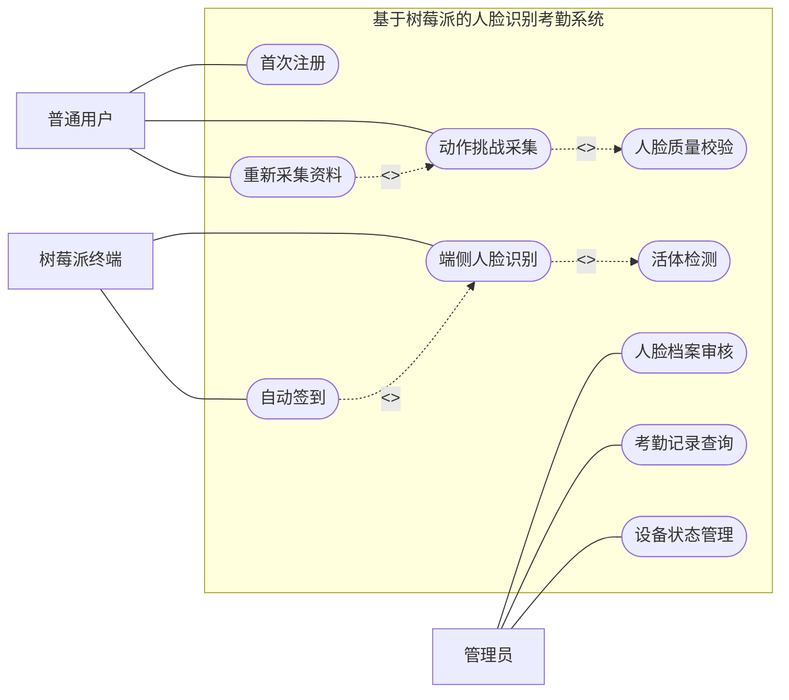

# 本文主要工作 UML 用例图修改

## 一、修改结论

原来的“本文主要工作关系”图不适合继续画成普通流程图。它描述的是系统有哪些参与者、系统提供哪些功能，以及这些功能之间的关系，因此更适合改为 **UML 用例图**。

建议图名：

> 图1.1 系统主要功能用例图

## 二、用例图编写规范

UML 用例图主要使用以下四类关系：

1. **关联关系**：参与者与用例之间的普通实线，不加箭头。
2. **包含关系**：`<<include>>`，虚线箭头，箭头指向被包含用例。
3. **扩展关系**：`<<extend>>`，虚线箭头，箭头指向被扩展的基础用例。
4. **泛化关系**：空心三角箭头，箭头指向父参与者或父用例。

本图建议只使用 **关联、包含、扩展** 三类关系，不强行使用泛化关系。因为本文系统中的普通用户、树莓派终端和管理员职责差异明显，不需要抽象成父参与者，否则会让图变得复杂。

## 三、draw.io 绘图步骤

### 1. 画系统边界

拖入一个大矩形框，标题写：

```text
基于树莓派的人脸识别考勤系统
```

所有用例椭圆都放在系统边界里面，参与者放在边界外面。

### 2. 画参与者

使用 UML 图形库中的小人图标，放置三个参与者：

- 左侧：`普通用户`
- 左下：`树莓派终端`
- 右侧：`管理员`

### 3. 画用例

系统边界内部使用椭圆 `Use Case`，建议放置：

- `首次注册`
- `动作挑战采集`
- `人脸质量校验`
- `人脸档案审核`
- `端侧人脸识别`
- `活体检测`
- `自动签到`
- `考勤记录查询`
- `设备状态管理`
- `重新采集资料`

### 4. 画关联关系

关联关系用普通实线，不加箭头：

```text
普通用户 —— 首次注册
普通用户 —— 动作挑战采集
普通用户 —— 重新采集资料
树莓派终端 —— 端侧人脸识别
树莓派终端 —— 自动签到
管理员 —— 人脸档案审核
管理员 —— 考勤记录查询
管理员 —— 设备状态管理
```

### 5. 画包含关系

包含关系表示主用例执行时必然调用另一个用例，使用虚线箭头并标注 `<<include>>`：

```text
动作挑战采集 ..> 人脸质量校验 : <<include>>
端侧人脸识别 ..> 活体检测 : <<include>>
自动签到 ..> 端侧人脸识别 : <<include>>
```

注意：箭头指向“被包含”的用例。

### 6. 画扩展关系

扩展关系表示在特定条件下才发生的补充行为，使用虚线箭头并标注 `<<extend>>`：

```text
重新采集资料 ..> 动作挑战采集 : <<extend>>
```

这里的含义是：当人脸档案被驳回或需要更新资料时，用户才会重新进入采集流程，因此它不是每次都必然发生，适合用扩展关系。

## 四、draw.io 可导入的 Mermaid 草图

说明：Mermaid 不能完全替代标准 UML 用例图。下面代码用于快速生成布局，导入 draw.io 后建议手动把参与者改成小人图标，把系统边界和用例样式调整为论文黑白风格。



## 五、论文图下说明建议

图\ref{fig:chapter1_work}从UML用例视角概括了本文系统的主要功能边界。普通用户主要参与首次注册、动作挑战、人脸采集和驳回后的重新采集；树莓派终端主要承担端侧人脸识别、活体检测和自动签到；管理员主要负责人脸档案审核、考勤记录查询和设备状态管理。图中实线表示参与者与用例之间的关联关系，虚线箭头表示用例之间的包含或扩展关系。与普通流程图相比，用例图更能体现本文工作的系统边界、参与对象和功能完整性。
