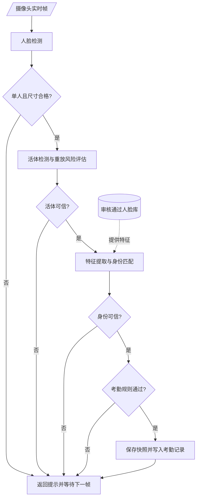

# 端侧识别流程图修改

## 一、对“端侧识别流程图”进行更改

### 更改原因

原图把检测、活体、匹配、稳定帧、考勤规则等步骤全部横向展开，放入论文后宽度过大，节点文字容易缩小到看不清。新图将实现中的细粒度判断归并为四类门禁：人脸检测门禁、活体安全门禁、身份匹配门禁和考勤规则门禁，使图形更适合论文版面。

### 建议图名

图3.x 端侧识别与考勤写入流程图

### 更改后的 Mermaid 代码

## 二、对图下说明段落进行更改

### 更改位置

建议替换论文中“端侧识别流程”图下方，从“由图\ref{fig:recognition_pipeline}可知……”开始的说明段落。

### 更改后的段落

由图\ref{fig:recognition_pipeline}可知，端侧识别流程并不是在检测到人脸后立即写入考勤记录，而是按照“人脸检测、活体安全、身份匹配、考勤规则”四类门禁逐步放行。系统首先从摄像头读取实时帧，并检测画面中是否只有一张人脸且人脸区域是否满足最小尺寸要求；若未检测到人脸、出现多人入镜或人脸过小，则直接返回提示并等待下一帧。检测通过后，系统对人脸区域进行活体检测和重放风险评估，用于拦截照片、屏幕翻拍等非真人签到情况。随后，系统提取当前人脸特征，并仅与管理员审核通过的人脸档案进行相似度匹配；当匹配结果未达到阈值或存在歧义时，同样拒绝签到。身份可信后，系统继续检查考勤时间窗和重复签到限制，只有所有条件均满足时，才保存现场快照并写入考勤记录。该流程将模型判断与业务规则结合起来，保证终端签到结果具有较好的实时性、可追溯性和安全性。
